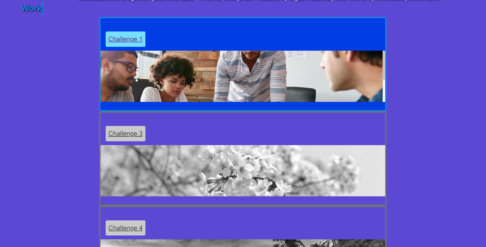

# Allie-Portfolio

## Description
Challenge 2 coursework for UT bootcamp. This challenge represents
my portfolio on GitHub, with the challenges and projects to be 
completed, to show. For the time being, there are placeholders
set for various works, as well as contact information.

## Usage
This webpage is designed to be a portfolio for my 
GitHub projects that I will be tackling throughout my
time at the UT coding bootcamp for fall of 2023.

It features an 'About Me' section, to describe who I am,
a 'Work' section to show off current (and future) projects
[currently with placeholders for most], and a 'Contact Me'
section with ways of getting into contact with me. There is 
also a 'Resume' section on the top right.

Simply click on the link and watch the magic happen.
Link to the website: https://alliestewart.github.io/Allie-Portfolio/

## Screenshots
--Top of page and About Me--
(About Me has some placeholder text. Thanks, Will.)

--Start of Work--
(Note how the project is no longer grey when the mouse hovers over it.)
(Additionally, only Challenge 1 has a working link, the rest just link back to my GitHub.)

--Continuing down Work--

--Bottom of page and Contact--
(Contact info is currently full of placeholders, except for the GitHub link.)

## What I Have Learned
I learned a lot about HTML and CSS design- with HTML, I learned how to 
keep the code mostly organized, and with CSS, I learned how to create
webpage designs a bit better... But not quite up to where I want them to be.

## Credits
Made by Allie Stewart. 
Images within the webpage were provided for by https://unsplash.com.

I sought out assistance from https://www.w3schools.com/ for CSS help a lot.

## Licenses
Please refer to the LICENSE in the repository.
